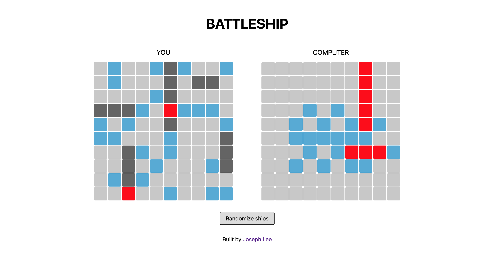

# Battleship

My implementation of the [Battleship project](https://www.theodinproject.com/lessons/node-path-javascript-battleship) from [The Odin Project](https://www.theodinproject.com/). Take a look at the [live preview](https://jooo-lee.github.io/battleship/)!

## Description:

This is a web-based version of the classic game 'Battleship', built to be played against the computer. Each player starts with 5 ships, and they do not know where their opponent has placed their ships. The players take turns shooting at each other's ships, trying to sink them all.

## Instructions:

Click the 'randomize ships' button to reset your ship placement. When you're ready to start, click on a square of the computer player's board to attack it. If the square turns blue, it means that there is no ship at that square. If the square turns red, it means that you've hit an enemy ship. Woohoo! You will need to hit each square that the enemy ship occupies in order to sink it. After the computer attacks one of your squares, it will be your move again. Keep going until one of you has sunk all of the other player's ships!

## Features:

-   Unit tests for the `Gameboard`, `Player` and `Ship` classes
-   Button for randomizing ship placement
-   'Computer' player capable of making moves

## I learned how to:

-   Use TDD philosophy to write unit tests with Jest

## Future features:

-   Smarter AI
-   Sound effects on hits and misses
-   Ships remaining counter

## Acknowledgements:

[Ship favicon](https://favicon.io/emoji-favicons/ship) from [favicon.io](https://favicon.io/).
